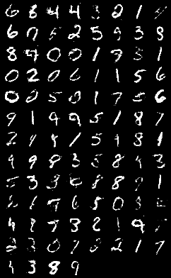

# MNIST_GAN_SYNTHESIS
This repo contains the GAN systhesis for MNIST dataset.  
This picture explains how GAN works: 
</img>

The dataset has been divided into train and test data for cross validation. The batch size is 100 and epoch is 200.  
Here is the result: 
</img>
