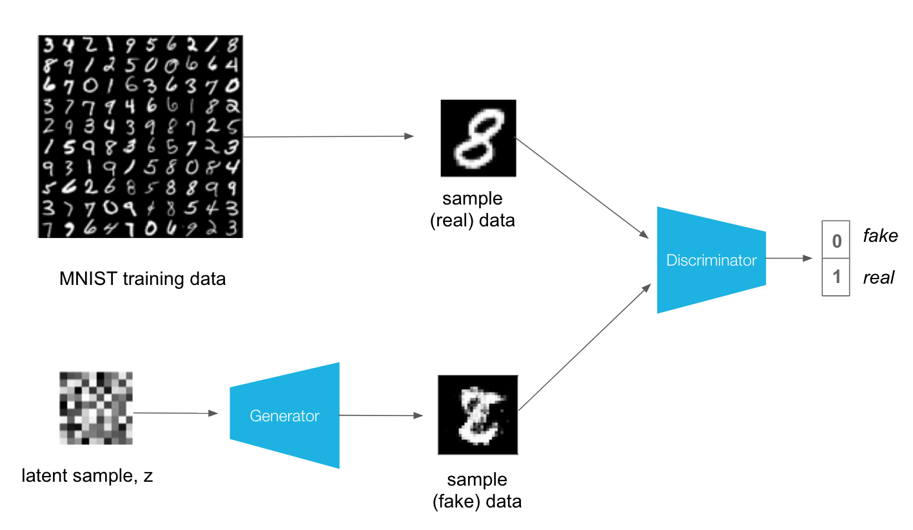

# MNIST_GAN_SYNTHESIS
This repo contains the GAN systhesis for MNIST dataset.  
 How GAN works: 
1. The Discriminator learns the real and fake image;  
2. After passing the generated image to Discriminator, the Generator takes feedback from Discriminator.  
<b>Dataset:</b>60,000 training small square 28×28 pixel grayscale images of handwritten single digits between 0 and 9  
           training set: 60000
           testing set: 10000
           batch size: 100
<b>Model Architecture:</b>  
Generator: FC layers + leaky ReLu  
Discriminator: FC layers + leaky ReLu + Dropout (0.3)  
Loss Function: Cross Entropy Loss  
Learning Rate: 0.0002  
<b>Model Training:</b>
On Discriminator: summing the loss of both real and fake to update parameters 
On Generator:passing the noise to Discriminator; calculating the loss then update the weighs 
<b> Highlights: </b> 
1. When the Discriminator learns the fake image, the ground truth is 0; 
2. When passing the fake image from Generator to Discriminator, the ground truth is 1.  
This picture explains how GAN works: 
</img> 
This is what the noise looks like: 
</img>

The dataset has been divided into train and test data for cross validation. The batch size is 100 and epoch is 200.  
Here is the result: 
</img>
